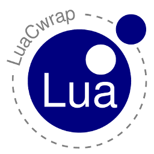

# Introduction

LuaCwrap is a wrapper for C datatypes written in pure C. It utilizes metadata (aka type descriptors)
to describe the layout and names of structures, unions, arrays and buffers.

## Features

LuaCwrap

 * supports struct and union types
 * supports array types
 * supports fixed length buffers
 * supports pointers
 * lua strings and userdata could be assigned to pointer attributes
 * maintains lifetime of lua objects which had been assigned to pointer attributes
 * support for reference attributes (manual control lifetime of assigned lua object)
 * supports customizeable method table for struct and union types
 * supports C and Lua API

# Prerequisites

Depends on Lua, the Lua development packages. LuaRocks is used for build/install.

## Linux

Install the following packages

    sudo apt-get install liblua5.1-0 liblua5.1-0-dev

## Windows

For a beginner I would recommend to install the latest "Lua for Windows" 
setup from from http://luaforwindows.googlecode.com/ and install 
LuaCWrap via LuaRocks.

# Installation via Luarocks

Install on console via 

    luarocks install luacwrap

# Usage

## Boxed/Embedded objects

LuaCwrap deals with two types of objects:

  * Boxed objects
  * Embedded objects

The lifetime of both object types are controlled by the Lua VM. Boxed objects are 'toplevel'
whereas Embedded objects reference 'embedded' objects within so called 'outer' objects. Because of that Embedded 
objects have to control the lifetime of their outmost boxed object.

<pre id="boxedobject" class="textdiagram">

            Boxed object (userdata )
     +----->+-----------------+--------+------------->metatable
     |      |cBLU             |        |                __index     Boxed_index
     |      |                 |        |                __newindex  Boxed_newindex
     |      |object data      |        |                __tostring  Boxed_tostring
     |      |                 |        |                __len       Boxed_len
     |      |                 |        |
     |  +-->+-----------------+        +------------->environment
     |  |   |c1FF             |                         $desc     typedescriptor
     |  |   +-----------------+                         pointer references (offset as key)
     |  |   |cBLU             |
     |  |   +-----------------+ 
     |  |
     |  |   Embedded object (userdata)
     |  |   +-----------------+--------+------------->metatable
     +------|outer            |        |                __index     Embedded_index
        |   +-----------------+        |                __newindex  Embedded_newindex
        +---|offset           |        |                __tostring  Embedded_tostring
            +-----------------+        |                __len       Embedded_len
                                       |                __gc        Embedded_gc
                                       |
                                       +------------->environment
                                                        $desc     typedescriptor

</pre>

### Pointer attributes

If a boxed object contains a pointer attribute ($ptr) you are able to assign different 
Lua object types to the pointer attribute. These objects types like strings, userdata and light userdata 
include LuaCwrap objects which makes it possible to create pointer connected data structures.
To couple the lifetime of Lua objects that had been assigned to a pointer attribute to the lifetime of 
the outer object a reference to the Lua object pointed to is stored within the environment table
of the outer object.
To handle union types correctly the pointer attribute offset is used as the table key. The table value
contains the referenced value.

### Reference attributes

Sometimes it is necessary to manually control the lifetime of Lua objects pointed to by
pointer attributes. For this reference attributes ($ref) are used. If you assign Lua objects to 
reference attributes a reference to the Lua object is stored in a hidden reference table under a unique
integer id. The integer id is assigned to the reference attribute. On reading a reference attribute the
integer id is returned as a reference object. This reference object can be used to access the underlying 
Lua object (via `refobject.value`) the reference index number (via `refobject.ref`) or to release the 
reference manually (via `refobject:release()`). 

### Light embedded objects

<pre id="cobjects" class="textdiagram">

            light userdata              C object
     +----->+-----------------+   +-->+-----------------+
     |      |                 |---+   |cBLU             |
     |      +-----------------+       |                 |
     |                                |object data      |
     |                                |                 |
     |                                |                 |
     |  +---------------------------->+-----------------+
     |  |                             |c1FF             |
     |  |                             +-----------------+
     |  |                             |cBLU             |
     |  |                             +-----------------+ 
     |  |
     |  |   Embedded object (userdata)
     |  |   +-----------------+--------+------------->metatable
     +------|outer            |        |                __index     Embedded_index
        |   +-----------------+        |                __newindex  Embedded_newindex
        +---|offset           |        |                __tostring  Embedded_tostring
            +-----------------+        |                __len       Embedded_len
                                       |                __gc        Embedded_gc
                                       |
                                       +------------->environment
                                                        $desc     typedescriptor

</pre>

Embedded objects can also be used to push C pointers during calls from C to Lua. But in this case you 
hav to be aware that in most cases the C pointer isn't valid after the Lua function scope ends. 
If you want to store the referenced value you have to duplicate the underlying instance via 
<object>:__dup(), which creates a new boxed object.

    function callback_from_C(myobject)
      mystorage[#mystorage+1] = myobject:__dup()
    end

Another issue of C controlled objects is that they have no associated Lua environment table. 
If you set pointer attributes to your own Lua objects, you have to take care that they don't 
go out of scope. Otherwise the C function returned to after the assignment could try to access 
memory that has already been garbage collected. A good advice is to use light embedded objects 
only when they do not contain pointer attributes.

## Dual interface

The LuaCwrap exports several functions. One of them, the `luaopen_luacwrap`
function, enables that LuaCwrap could be used from standalone Lua scripts.
The other functions could be bound to by C modules or executables
to be able to register object descriptors or to create/push object instances
on the Lua stack.

## Lua-API

### Import LuaCwrap

Importing LuaCwrap is only necessary if you want to declare your own types via the Lua-API.
In this case use the followig line:

    luacwrap = import("luacwrap")

C modules which want to provide wrappers usually create their own namespace table to register their types. 
For an example see the source code of the `testluacwrap` module, which is provided with this package 
for unit testing.

### Registering type descriptors

#### Register array types

    type = luacwrap.registerarray(name, size, elemtype)

#### Register record types

    type = luacwrap.registerstruct(name, members)

#### Register buffer types

    type, name = luacwrap.registerbuffer(name, size)

### Create/Attach instances

Every registered type descriptor has two methods `new` and `attach` which could be used to
create new instances or create a wrapper around existing userdata.

    local struct = TESTSTRUCT:new()           -- create new garbage collected struct
    local wrap = TESTSTRUCT:attach(udata)     -- attach descriptor to (light) user data

### Initialize instance content

By default the `new` function initializes objects with 0. An aditional init parameter
changes this behaviour. If you specify a number as init parameter the object memory is 
filled with the given number value.
If you give a lua table the `new` function it assigns the name/value pairs to 
the corresponding attributes. This works recursively for embedded object instances. 

    local mystruct = struct = TESTSTRUCT:new{
      u8  = 91,
      i32 = 96,
      ptr = "hello",
      chararray = "hello",
      intarray = { 19,
             29,
             39,
             49,
      }
    }

An additional `set` function makes it possible to initialize existing object instances
from a given table of values.

    mystruct:set{
      u8  = 91,
      i32 = 96,
      ptr = "hello",
      chararray = "hello",
      intarray = { 19,
             29,
             39,
             49,
      }
    }

### Assign attribute values
    
Object attributes can be accessed like Lua table items.

    -- set
    mystruct.u32 = 100
    mystruct["u32"] = 100
    -- get
    local myval = mystruct.u32
    myval = mystruct["u32"]
    
### Duplicate objects

The `new` function could also be used to duplicate objects. If the first parameter is a 
object of the same type the contents of that object are used to initialize the newly created one.

    local mynewstruct = TESTSTRUCT:new(mystruct)

A shorter form is to use the `object:__dup()` function

    local mynewstruct = mystruct:__dup()

### Customizeable method table for struct and union types

You can easily extend struct and union types, that have been registered via luacwrap.
E.g. you have registered a rect structure under the name RECT, then you can add  
methods simply by adding them to the RECT type descriptor.

    function RECT:width()
      return self.right - self.left
    end

    function RECT:height()
        return self.bottom - self.top
    end

After that you can use these methods as follows:

    local rc = RECT:new()
    rc.set{ top=10; left=10; bottom=100; right=100 }
    print(rc:width(), rc:height())
 
## C-API

### Registering type descriptors

#### Register array types

    // describe array type
    LUACWRAP_DEFINEARRAY(LIBRARYNAME, INT32, 4)

    luacwrap_registertype(L, LUA_GLOBALSINDEX, &regType_INT32_4.hdr);

#### Register record types

    // member descriptor for INNERSTRUCT
    static luacwrap_RecordMember s_memberINNERSTRUCT[] =
    {
      { "pszText",  offsetof(INNERSTRUCT, pszText),  "$ptr" },
      { NULL, 0 }
    };

    // type descriptor for INNERSTRUCT
    LUACWRAP_DEFINESTRUCT(LIBRARYNAME, INNERSTRUCT)

    // register type within globals table
    luacwrap_registertype(L, LUA_GLOBALSINDEX, &regType_INNERSTRUCT.hdr);

#### Register buffer types

    luacwrap_BasicType regType_Buf32 =
    {
      LUACWRAP_TC_BUFFER,
      "$buf32",
      32
    };

    luacwrap_registerbasictype(L, &regType_Buf32);

#### Register basic types

For these types you have to specify appropriate get and set callbacks which handles
marshalling. Therefore registering basic types is only possible via the C API.
Use the `luacwrap_registerbasictype` function and see the source of LuaCwrap
for usage examples.

### Create wrappers for local C objects (light embedded objects)

From the C API in most cases you push wrapper objects (light embedded objects) to static 
instances to call functions with parameters. 

    // static instance
    TESTSTRUCT ud = { 0 };
    
    // fill struct with data
    ud.u8  =   8;
    ud.i8  =  -8;
    ...

    // call "myfunction" with wrapped object as parameter 1
    lua_getglobal(L, "myfunction");
    
    // push wrapper
    luacwrap_pushtypedptr(L, &regType_TESTSTRUCT.hdr, &ud);

    lua_call(L, 1, 0);

From Lua you use the instance as follows:

    function myfunction(teststruct)
      print(teststruct.u8)
    end

These wrappers are alive only during the function call.
It's definitely not a good idea to store them within the called function, e.g. in a global Lua variable or table. 
If you really have to, use the <code>object:__dup()</code> method to create a clone, which lifetime is controlled
by the Lua VM.

### Create boxed instances

Lifetime of boxed objects is maintained by the Lua garbage collector. To create them from the C API 
you use the luacwrap_pushboxedobj() function. 

    TESTSTRUCT* ud;
  
    // call "myfunction" with boxed object as parameter 1
    lua_getglobal(L, "myfunction");

    ud = (TESTSTRUCT*)luacwrap_pushboxedobj(L, &regType_TESTSTRUCT.hdr, 0);
    
    ud->u8  =   8;
    ud->i8  =  -8;
    ud->u16 =  16;
    ud->i16 = -16;
    ud->u32 =  32;
    ud->i32 = -32;
    ud->ptr =  "a ptr";
    
    lua_call(L, 1, 0);

From Lua you use the instance as follows:

    function myfunction(teststruct)
      print(teststruct.u8)
    end

### Attach to userdata

With the `typedesc:attach()` function you can attach a light embedded object to an 
Lua userdata object which is interpreted as a pointer address. The above C sample could be modified 
like this:

    // static instance
    TESTSTRUCT ud = { 0 };
    
    // fill struct with data
    ud.u8  =   8;
    ud.i8  =  -8;
    ...

    // call "myfunction" with wrapped object as parameter 1
    lua_getglobal(L, "myfunction");
    
    // push wrapper
    lua_pushlightuserdata(L, &ud);

    lua_call(L, 1, 0);

From Lua you access the instance as follows:

    function myfunction(pointer)
      local teststruct = TESTSTRUCT:attach(pointer)
      print(teststruct.u8)
    end

Because LuaCwrap allows to attach wrappers to existing userdata (pointers) it is not safe 
according to the Lua book. Common errors will be detected by LuaCwrap, but as the <code>attach</code>
method acts like a C cast many things could go wrong. So if you use <code>attach</code> be sure 
you know what you are doing.

###

# Internals

## Module table _M

LuaCwrap creates a single module table, where all module global data is stored.
The module table contains:

  * helper functions (e.g. tabletostring, getfield, setfield)
  * register functions (registerbuffer, registerarray, registerstruct)
  * buffer creation function (createbuffer)
  * reference release function (releasereference)
  * types table (_M.types)
  * reference table (_M.reftable)
  * string table (_M.stringtable)
  
## Type descriptor table _M.types

The type descriptor table spans the namespace for all registered types. Type names containing dots are
stored in the corresponding subtables.
The type table contains predefined types which names start with the '$' character. 
These are

  * $i8 , $u8  (signed/unsigned char)
  * $i16, $u16 (signed/unsigned short)
  * $i32, $u32 (signed/unsigned long)
  * $flt, $dbl (float, double)
  * $ptr       (pointer types)
  * $ref       (reference type utilizing the Lua reference mechanism)
  * $bufn      (buffer with length n, e.g. $buf128)
 
Buffers are registered within the type table, too. The name of buffer types is derived
from the buffer length ($bufn, where n denotes the buffer length).
If a buffer with the requested size is already registered, the existing one is returned.

## Reference table _M.reftable

This table is used to control the lifetime of reference attributes ($ref).

## String table _M.stringtable

Used by the register function to store unique strings used within type descriptors.

# License

LuaCwrap is licensed under the terms of the MIT license reproduced below.
This means that LuaCwrap is free software and can be used for both academic
and commercial purposes at absolutely no cost.

Copyright (C) 2011 Klaus Oberhofer

Permission is hereby granted, free of charge, to any person obtaining a copy
of this software and associated documentation files (the "Software"), to deal
in the Software without restriction, including without limitation the rights
to use, copy, modify, merge, publish, distribute, sublicense, and/or sell
copies of the Software, and to permit persons to whom the Software is
furnished to do so, subject to the following conditions:

The above copyright notice and this permission notice shall be included in
all copies or substantial portions of the Software.

THE SOFTWARE IS PROVIDED "AS IS", WITHOUT WARRANTY OF ANY KIND, EXPRESS OR
IMPLIED, INCLUDING BUT NOT LIMITED TO THE WARRANTIES OF MERCHANTABILITY,
FITNESS FOR A PARTICULAR PURPOSE AND NONINFRINGEMENT.  IN NO EVENT SHALL THE
AUTHORS OR COPYRIGHT HOLDERS BE LIABLE FOR ANY CLAIM, DAMAGES OR OTHER
LIABILITY, WHETHER IN AN ACTION OF CONTRACT, TORT OR OTHERWISE, ARISING FROM,
OUT OF OR IN CONNECTION WITH THE SOFTWARE OR THE USE OR OTHER DEALINGS IN
THE SOFTWARE.

